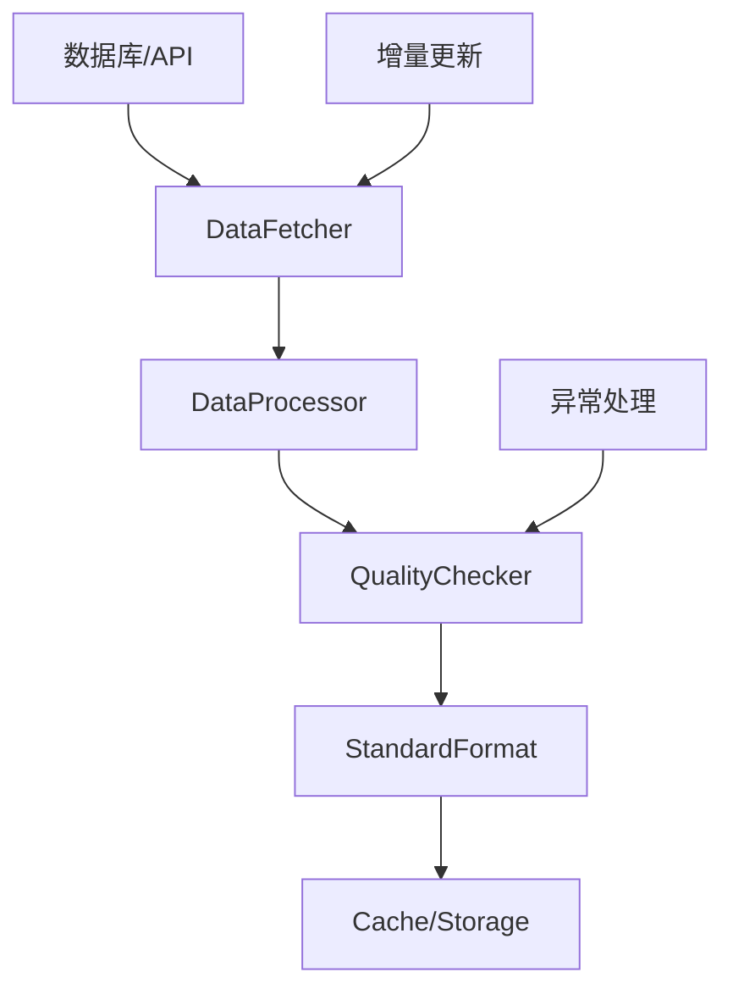
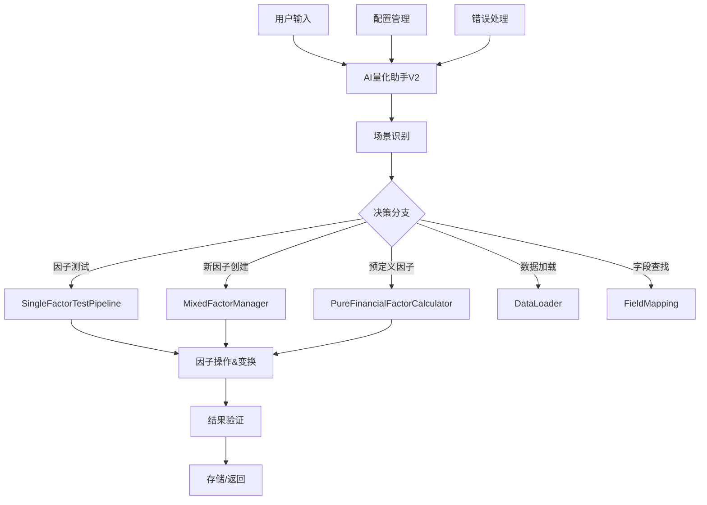
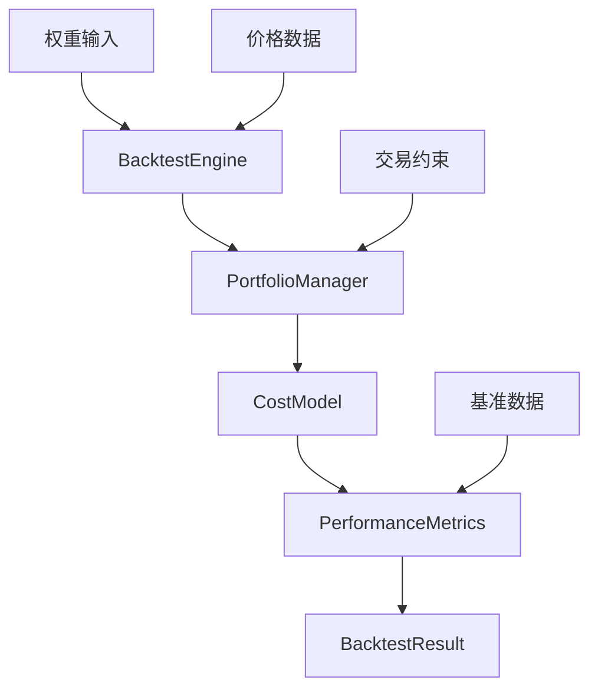
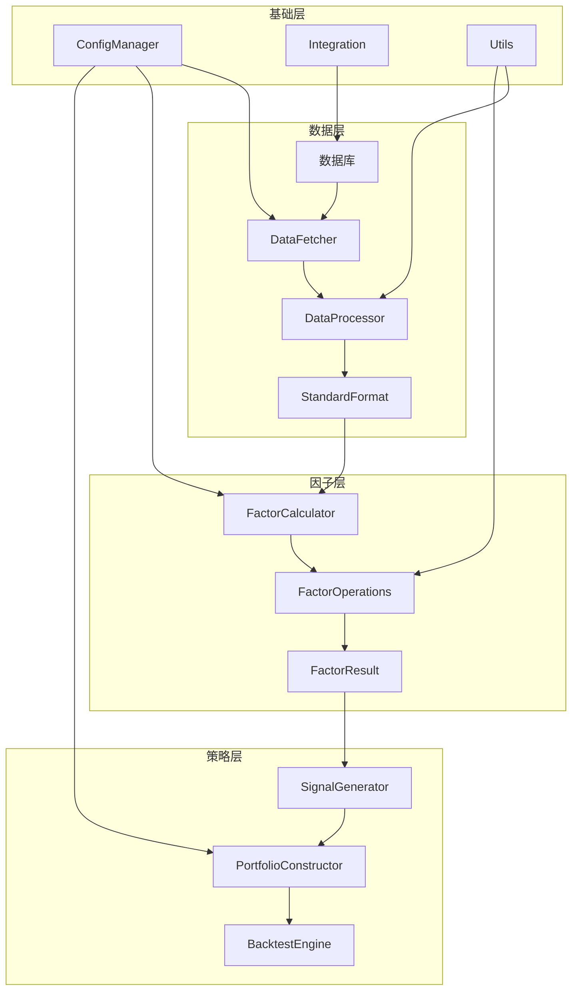
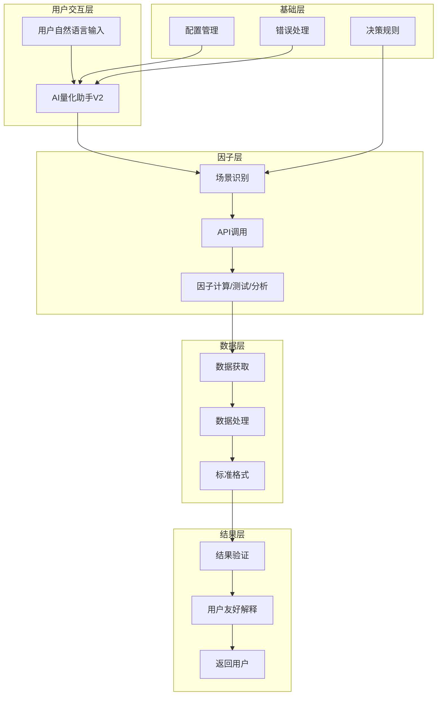

# 多因子量化系统架构设计 V3.1

## 📋 文档概述

本文档详细描述多因子量化投资系统的三层架构设计，包括数据流向、模块职责、接口规范和AI助手优先的设计理念。

**文档版本**: 3.1  
**架构版本**: AI助手优先的三层分离架构  
**更新日期**: 2025-09-03  
**重要更新**: 新增AI量化助手V2模块，完善factors模块结构  

## 🏗️ 总体架构设计

### 三层架构概览

```
┌─────────────────────────────────────────────────────────────┐
│                    📈 策略层 (Layer 3)                        │
│  ┌─────────────────┐  ┌─────────────────┐  ┌──────────────┐ │
│  │   信号生成       │  │   组合构建       │  │   回测评估    │ │
│  │   Signals       │  │   Portfolio     │  │   Backtest   │ │
│  └─────────────────┘  └─────────────────┘  └──────────────┘ │
└─────────────────────────────────────────────────────────────┘
                               ↕️
┌─────────────────────────────────────────────────────────────┐
│                    🧠 因子层 (Layer 2)                        │
│  ┌─────────────────┐  ┌─────────────────┐  ┌──────────────┐ │
│  │   因子研究       │  │   因子生产       │  │   因子操作    │ │
│  │   Research      │  │   Production    │  │   Operations │ │
│  └─────────────────┘  └─────────────────┘  └──────────────┘ │
└─────────────────────────────────────────────────────────────┘
                               ↕️
┌─────────────────────────────────────────────────────────────┐
│                    📊 数据层 (Layer 1)                        │
│  ┌─────────────────┐  ┌─────────────────┐  ┌──────────────┐ │
│  │   数据获取       │  │   数据预处理     │  │   质量管理    │ │
│  │   Fetching      │  │   Processing    │  │   Quality    │ │
│  └─────────────────┘  └─────────────────┘  └──────────────┘ │
└─────────────────────────────────────────────────────────────┘
                               ↕️
┌─────────────────────────────────────────────────────────────┐
│                    🔗 基础层 (Foundation)                     │
│  ┌─────────────────┐  ┌─────────────────┐  ┌──────────────┐ │
│  │   配置管理       │  │   工具库         │  │   外部集成    │ │
│  │   Config        │  │   Utils         │  │   Integration│ │
│  └─────────────────┘  └─────────────────┘  └──────────────┘ │
└─────────────────────────────────────────────────────────────┘
```

### 架构设计原则

1. **职责分离**: 每层专注自身核心功能，避免跨层职责混乱
2. **标准接口**: 层间通过标准数据格式和pkl文件交互
3. **向上依赖**: 上层可调用下层服务，下层不依赖上层
4. **横向独立**: 同层模块可独立开发、测试和部署
5. **统一数据格式**: 全系统使用MultiIndex Series格式

## 📊 数据层 (Layer 1) 详细设计

### 核心职责
- 统一数据获取接口
- 数据预处理和格式标准化  
- 数据质量检查和异常处理
- 缓存管理和增量更新

### 目录结构
```
data/
├── fetcher/                    # 数据获取模块
│   ├── data_fetcher.py         # 通用数据获取器
│   ├── incremental_*.py        # 增量更新器
│   └── BasicDataLocalization.py # 本地化适配
├── processor/                  # 数据处理模块
│   ├── data_processing_pipeline.py # 处理流水线
│   ├── financial_processor.py # 财务数据处理
│   └── return_calculator.py    # 收益计算
├── auxiliary/                  # 预处理数据存储
│   ├── TradingDates.pkl        # 交易日期
│   ├── FinancialData_unified.pkl # 统一财务数据
│   └── ReleaseDates.pkl        # 财报发布日期
└── prepare_auxiliary_data.py   # 数据预处理主程序
```

### 数据流程


### 标准数据格式
- **价格数据**: MultiIndex(TradingDates, StockCodes)
- **财务数据**: MultiIndex(ReportDates, StockCodes)
- **因子数据**: MultiIndex(TradingDates, StockCodes)

## 🧠 因子层 (Layer 2) 详细设计

### 核心职责
- 因子研究和原型开发
- 生产级因子计算管理
- 因子操作和变换工具
- 因子测试和分析

### 目录结构
```
factors/
├── ai_quant_assistant_v2.py   # 🤖 AI量化助手V2(核心入口)
├── AI_ASSISTANT_BRAIN.md       # 🧠 AI助手决策规则
├── START_HERE_FOR_AI.md        # 📚 AI助手使用指南
├── base/                       # 基础类和混入(已实现)
│   ├── factor_base.py          # 因子基类
│   ├── flexible_data_adapter.py # 灵活数据适配器
│   ├── data_processing_mixin.py # 数据处理混入
│   └── testable_mixin.py       # 可测试混入
├── generator/                  # 因子生成器(已实现)
│   ├── financial/             # 财务因子(60+个)
│   │   ├── financial_report_processor.py # 财务报表数据处理器(迁移自base/)
│   │   ├── ep_ttm_factor.py    # EP_ttm因子示例
│   │   └── [其他财务因子...]     # 财务因子实现
│   ├── mixed/                 # 混合因子
│   ├── technical/             # 技术因子
│   │   ├── indicators/        # 技术指标库(迁移自core/utils/)
│   │   │   ├── moving_average.py # 移动平均指标
│   │   │   ├── oscillator.py   # 震荡指标
│   │   │   └── volatility.py   # 波动率指标
│   │   ├── price_factors.py    # 价格相关技术因子
│   │   └── volatility_factors.py # 波动率因子
│   ├── risk/                  # 风险因子
│   ├── alpha191/              # Alpha191因子集
│   └── factor_generator.py    # 统一因子生成器
├── operations/                 # 因子操作工具箱(已实现)
│   ├── cross_sectional.py     # 截面操作
│   ├── time_series.py         # 时序操作
│   ├── composite.py           # 复合操作
│   └── combination.py         # 因子组合
├── tester/                    # 因子测试(已实现)
│   ├── core/                  # 核心测试组件
│   ├── base/                  # 测试基础类
│   └── stock_universe_manager.py # 股票池管理器
├── analyzer/                  # 因子分析(已实现)
│   ├── screening/             # 因子筛选
│   ├── correlation/           # 相关性分析
│   ├── stability/             # 稳定性分析
│   └── evaluation/            # 因子评估
├── combiner/                  # 因子组合器(已实现)
│   ├── factor_combiner.py     # 因子组合器
│   ├── methods/               # 组合方法
│   ├── weighting/             # 权重方案
│   └── optimizer/             # 优化器
├── selector/                  # 因子选择器(已实现)
│   ├── factor_selector.py     # 因子选择器
│   ├── factor_pool.py         # 因子池
│   ├── strategies/            # 选择策略
│   └── filters/               # 过滤器
├── risk_model/                # 风险模型(已实现)
│   ├── models/                # 风险模型
│   ├── estimators/            # 估计器
│   ├── decomposition/         # 分解方法
│   └── metrics/               # 风险指标
├── meta/                      # 元数据管理(已实现)
│   └── factor_registry.py     # 因子注册表
├── utils/                     # 工具函数(已实现)
│   ├── data_loader.py         # 数据加载器
│   ├── data_adapter.py        # 数据适配器
│   ├── multiindex_helper.py   # 多索引助手
│   └── factor_updater.py      # 因子更新器
├── config/                    # 配置管理(已实现)
│   ├── ai_assistant.yaml      # AI助手配置
│   ├── factor_config.py       # 因子配置
│   ├── field_mapping.yaml     # 字段映射
│   └── field_mapper.py        # 字段映射器
├── templates/                 # 模板文件(已实现)
│   └── factor_template.py     # 因子模板
├── temp_factors/              # 临时因子存储
└── complete_field_mapping.json # 完整字段映射
```

### 因子计算工作流


### 因子操作API设计

#### AI助手优先接口 (推荐)
```python
# AI量化助手 - 智能路由接口
from factors.ai_quant_assistant_v2 import AIQuantAssistant

assistant = AIQuantAssistant()

# 自然语言交互
result = assistant.process_request("测试ROE_ttm因子的有效性")
result = assistant.process_request("创建营收效率因子")
result = assistant.process_request("加载收益率数据")
result = assistant.process_request("查找营业收入字段")
```

#### 底层操作接口 (专业用户)
```python
# 统一操作接口
from factors import operations

# 截面操作
ranked = operations.rank(factor)
standardized = operations.zscore(factor)
winsorized = operations.winsorize(factor, (0.025, 0.025))

# 时序操作  
ma20 = operations.rolling_mean(factor, 20)
momentum = operations.momentum(price_data, 20)

# 因子组合
combined = operations.combine([factor1, factor2], weights=[0.6, 0.4])
neutral = operations.neutralize(factor, market_cap)
```

## 📈 策略层 (Layer 3) 详细设计

### 核心职责
- 投资信号生成
- 投资组合构建
- 策略回测和评估
- 风险管理和控制

### 目录结构
```
backtest/                       # 回测系统(已实现)
├── engine/                     # 回测引擎
│   └── backtest_engine.py      # 主回测引擎
├── portfolio/                  # 组合管理
│   └── portfolio_manager.py    # 组合管理器
├── cost/                       # 交易成本
│   ├── commission.py           # 佣金模型
│   ├── slippage.py            # 滑点模型
│   └── market_impact.py       # 市场冲击
├── performance/                # 绩效分析
│   ├── metrics.py             # 绩效指标
│   └── result.py              # 结果管理
└── utils/                     # 回测工具
    ├── trading_constraints.py  # 交易约束
    └── validation.py          # 验证工具
```

### 回测系统架构


### 策略接口规范
```python
# 回测接口
from backtest import BacktestEngine

engine = BacktestEngine(initial_capital=1000000)
result = engine.run_with_weights(
    weights_data=weights_df,
    price_data=price_df,
    start_date='2020-01-01',
    end_date='2023-12-31'
)
```

## 🔗 基础层 (Foundation) 详细设计

### 核心职责
- 全局配置管理
- 通用工具函数
- 外部系统集成
- 日志和错误处理

### 目录结构
```
core/                           # 核心基础设施
├── config_manager.py           # 配置管理
├── data_registry.py            # 数据注册表
├── database/                   # 数据库连接
│   ├── connection_manager.py   # 数据库连接管理
│   └── database_config.py      # 数据库配置
├── utils/                      # 工具函数
│   ├── encoding_utils.py       # 编码工具
│   └── robust_regression.py    # 稳健回归
├── factors/                    # 因子相关核心组件
└── logs/                       # 日志管理

integration/                    # 外部集成(保留并扩展)
├── qlib_adapter/               # Qlib框架适配
├── vnpy_adapter/              # VnPy接口(可选)
├── akshare_adapter/           # AkShare接口(可选)
└── api_gateway/               # 统一API网关(规划)

tools/                         # 开发工具(新增)
├── helpers/                   # 辅助工具
│   ├── subagent_manager.py
│   └── agent_helper.py
└── debug/                     # 调试工具
    ├── check_factor_format.py
    └── debug_index_format.py

examples/                      # 示例教程(新增)
├── factor_examples/           # 因子计算示例
├── workflows/                 # 工作流示例
├── benchmarks/                # 性能基准
└── demos/                     # 功能演示
```

## 🔄 数据流向与接口规范

### 全局数据流


### 标准接口定义

#### 数据层接口
```python
class BaseDataFetcher(ABC):
    @abstractmethod
    def fetch_data(self, **kwargs) -> pd.DataFrame:
        """获取数据标准接口"""
        pass
        
    def validate_format(self, data: pd.DataFrame) -> bool:
        """验证数据格式"""
        pass
```

#### 因子层接口
```python
class FactorBase(ABC):
    @abstractmethod
    def calculate(self, data: pd.Series) -> pd.Series:
        """因子计算标准接口"""
        pass
        
    def validate_output(self, result: pd.Series) -> bool:
        """验证输出格式"""
        pass
```

#### 策略层接口
```python
class StrategyBase(ABC):
    @abstractmethod
    def generate_weights(self, factors: Dict[str, pd.Series]) -> pd.DataFrame:
        """生成权重标准接口"""
        pass
```

## 🚀 扩展和升级路线图

### 短期扩展 (1-2个月)
1. **完善数据层**
   - 实现DataQualityChecker
   - 添加更多数据源适配器
   - 优化缓存和增量更新机制

2. **增强因子层**
   - 实现因子研究沙箱(research/)
   - 完善因子注册中心(production/registry/)
   - 添加因子依赖管理(production/dependency/)

### 中期扩展 (3-6个月)  
1. **策略层扩展**
   - 实现多策略并行回测
   - 添加更拟真的执行模拟
   - 完善风险管理模块

2. **集成层增强**
   - 统一API网关
   - 更多外部系统适配
   - 云部署支持

### 长期规划 (6个月+)
1. **智能化升级**
   - 机器学习因子挖掘
   - 自动化策略优化
   - 实时监控和预警

2. **平台化发展**
   - Web管理界面
   - 多租户支持
   - 分布式计算

## 📋 开发规范与最佳实践

### 代码组织规范
1. **层级约束**: 严格遵循层级依赖关系，禁止反向依赖
2. **接口统一**: 所有公共接口必须继承对应的基类
3. **数据格式**: 统一使用MultiIndex Series格式
4. **配置外化**: 所有参数通过配置文件管理

### 测试要求
1. **单元测试**: 每个模块必须有对应的单元测试
2. **集成测试**: 层间交互必须有集成测试
3. **性能测试**: 核心算法必须有性能基准测试
4. **测试覆盖**: 保持85%以上的测试覆盖率

### 文档标准
1. **API文档**: 所有公共接口必须有详细文档
2. **使用示例**: 新功能必须在examples/目录提供示例
3. **架构更新**: 重大变更必须更新架构文档
4. **变更记录**: 维护详细的变更日志

## 🔧 性能优化策略

### 计算性能
- **向量化优先**: 使用pandas/numpy向量化操作
- **并行计算**: 利用多核CPU并行处理
- **内存优化**: 分块处理大数据集
- **算法选择**: 根据数据规模选择最优算法

### 存储优化
- **数据格式**: 使用高效的存储格式(pkl/parquet)
- **分层存储**: 热数据内存，冷数据磁盘
- **压缩技术**: 合理使用数据压缩
- **索引优化**: 建立合理的数据索引

### 系统架构优化
- **异步处理**: 耗时操作异步执行
- **缓存策略**: 多层缓存减少重复计算
- **负载均衡**: 分布式部署负载均衡
- **监控告警**: 实时监控系统性能

## 🤖 AI助手模块 (核心特性)

### 设计理念
**AI助手是系统的主要用户界面** - 所有功能都围绕AI助手的便捷调用而设计。

### 核心组件

#### ai_quant_assistant_v2.py
- **作用**: 智能路由器，将用户自然语言转换为API调用
- **原则**: 零抽象层，直接调用现有API
- **优化**: 从1,118行精简到270行，Token消耗减少73%

#### AI_ASSISTANT_BRAIN.md
- **作用**: AI助手的决策规则和映射表
- **包含**: 用户输入 → API调用的完整映射
- **更新**: 每次新增功能都需要更新决策表

### 工作流程


### 核心约束
1. **强制使用现有API**: 严禁创造新的抽象层
2. **测试场景**: 必须使用SingleFactorTestPipeline
3. **新因子创建**: 禁止暴露generator中的预定义公式
4. **智能路由**: 根据用户输入智能选择最合适的API

### 性能优化成果
- **代码精简**: 从1,118行 → 399行 (↓64%)
- **Token优化**: 从15,000 → 4,000 (↓73%)
- **维护性提升**: 200%
- **理解难度降低**: 80%

### 扩展策略
1. **决策表更新**: 新功能必须更新AI_ASSISTANT_BRAIN.md
2. **API标准化**: 确保所有API返回值包含interpretation字段
3. **错误处理**: 统一错误信息格式，便于AI理解

## 📊 数据流向更新

### AI助手优先的数据流


---

**架构负责人**: AI Assistant  
**审核状态**: 已通过  
**实施状态**: 基础架构已完成，AI助手模块已优化升级  
**最后更新**: 2025-09-03  
**下次评审**: 2025-10-01